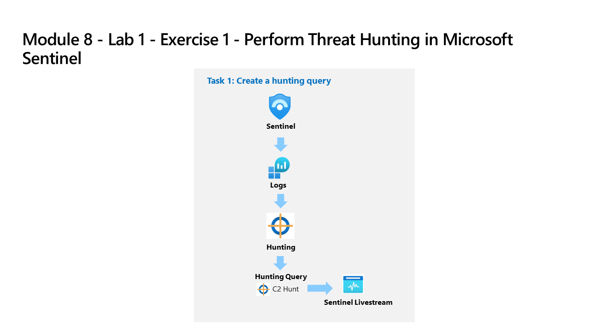

---
lab:
    title: 'Exercise 1 - Perform Threat Hunting with Microsoft Sentinel in the Microsoft Defender portal'
    module: 'Learning Path 10 - Perform threat hunting in Microsoft Sentinel'
---

# Learning Path 10 - Lab 1 - Exercise 1 - Perform Threat Hunting with Microsoft Sentinel in the Microsoft Defender portal

## Lab scenario



You're a Security Operations Analyst working at a company that implemented Microsoft Sentinel. You have received threat intelligence about a Command and Control (C2 or C&C) technique. You need to perform a hunt and watch for the threat.

>**Important:** The lab exercises for Learning Path #10 are in a *standalone* environment. If you exit the lab before completing it, you will be required to re-run the configurations again.

<!--- The log data created in the Learning Path 9 lab exercises will not be available in this lab without rerunning the following prerequisite tasks.

 **[Lab 09 Exercise 5](https://microsoftlearning.github.io/SC-200T00A-Microsoft-Security-Operations-Analyst/Instructions/Labs/LAB_AK_09_Lab1_Ex05_Attacks.html)**

**[Lab 09 Exercise 6](https://microsoftlearning.github.io/SC-200T00A-Microsoft-Security-Operations-Analyst/Instructions/Labs/LAB_AK_09_Lab1_Ex06_Perform_Attacks.html)** --->

### Estimated time to complete this lab: 45 - 60 minutes

>**Note:** The following *Prerequisite tasks* Are pre-configured for you. They are included here for your information only.

### Prerequisite task 1: Connect an On-Premises Server

In this task, you'll connect an on-premises server to your Azure subscription. Azure Arc was pre-installed on this server. The server will be used in next exercises to run simulated attacks that you will later detect and investigate in Microsoft Sentinel.

>**Important:** The next steps are done on a different machine than the one you were previously working. Look for the Virtual Machine name in the references tab.

1. Log in to **WINServer** virtual machine as Administrator with the password: **Passw0rd!** if necessary.  

As described above, Azure Arc has been pre-installed on the **WINServer** machine. You will now connect this machine to your Azure subscription.

1. On the *WINServer* machine, select the *search* icon and type **cmd**.

1. In search results right click *Command Prompt* and select **Run as administrator**.

1. In the Command Prompt window, type the following command. *Do not press enter*:

    ```cmd
    azcmagent connect -g "defender-RG" -l "EastUS" -s "Subscription ID string"
    ```

1. Replace the **Subscription ID string** with the *Subscription ID* provided by your lab hoster (*Resources tab). Make sure to keep the quotes.

1. Type **Enter** to run the command (this may take a couple minutes).

    >**Note**: If you see the *How do you want to open this?* browser selection window, select **Microsoft Edge**.

1. In the *Sign in* dialog box, enter your **Tenant Email** and **Tenant Password** provided by your lab hosting provider and select **Sign in**. Wait for the *Authentication complete* message, close the browser tab and return to the *Command Prompt* window.

1. When the commands complete running, leave the *Command Prompt* window open and type the following command to confirm that the connection was successful:

    ```cmd
    azcmagent show
    ```

1. In the command output, verify that *Agent status* is **Connected**.

### Prerequisite task 2: Connect a non-Azure Windows Machine

In this task, you'll add an Azure Arc connected, on-premises machine to Microsoft Sentinel.  

>**Note:** Microsoft Sentinel has been predeployed in your Azure subscription with the name **defenderWorkspace**, and the required *Content Hub* solutions have been installed.

1. Login to **WIN1** virtual machine as Admin with the password: **Pa55w.rd**.  

1. In the Microsoft Edge browser, navigate to the Microsoft Defender portal at <https://security.microsoft.com>.

1. In the **Sign in** dialog box, copy, and paste in the **Tenant Email** account provided by your lab hosting provider and then select **Next**.

1. In the **Enter password** dialog box, copy, and paste in the **Tenant Password** provided by your lab hosting provider and then select **Sign in**.

1. In the Microsoft Defender navigation menu, scroll down and expand the **Microsoft Sentinel** section.

1. Expand the **Configuration** section and select **Data connectors**.

1. In the *Data connectors*, search for the **Windows Security Events via AMA** solution and select it from the list.

1. On the *Windows Security Events via AMA* details pane, select **Open connector page**.

    >**Note:** The *Windows Security Events* solution installs both the *Windows Security Events via AMA* and the *Security Events via Legacy Agent* Data connectors. Plus 2 Workbooks, 20 Analytic Rules, and 43 Hunting Queries.

1. In the *Configuration* section, under *Prerequisites* and *Table Management*, select **+Create data collection rule**.

1. Enter **AZWINDCR** for Rule Name, verify that *Subscription* is correct, select the **defender-RG** Resource Group.

1. Select **Next: Resources**.

1. Expand your *Subscription* under *Scope* on the *Resources* tab.

    >**Hint:** You can expand the whole *Scope* hierarchy by selecting the ">" before the *Scope* column.

1. Expand **defender-RG** Resource Group, then select **WINServer**.

1. Select **Next: Collect**, and leave the *All Security Events* selected.

1. Select **Next: Review + create**.

1. Select **Create** after *Validation passed* is displayed.

### Prerequisite task 3: Command and Control Attack with DNS

>**Important:** The next steps are done on a different machine than the one you were previously working. Look for the Virtual Machine name in the references tab.

1. Log in to **WINServer** virtual machine as Administrator with the password: **Passw0rd!** if necessary.

1. On the *WINServer* machine, select the *search* icon and type **cmd**.

1. In search results right click *Command Prompt* and select **Run as administrator**.

1. Copy and run this command to create a script that will simulate a DNS query to a C2 server:

    ```CommandPrompt
    notepad c2.ps1
    ```

1. Select **Yes** to create a new file and copy the following PowerShell script into *c2.ps1*.

    >**Note:** Pasting into the virtual machine file might not show the full script length. Make sure the script matches  the instructions within the *c2.ps1* file.

    ```PowerShell
    param(
        [string]$Domain = "microsoft.com",
        [string]$Subdomain = "subdomain",
        [string]$Sub2domain = "sub2domain",
        [string]$Sub3domain = "sub3domain",
        [string]$QueryType = "TXT",
        [int]$C2Interval = 8,
        [int]$C2Jitter = 20,
        [int]$RunTime = 240
    )
    $RunStart = Get-Date
    $RunEnd = $RunStart.addminutes($RunTime)
    $x2 = 1
    $x3 = 1 
    Do {
        $TimeNow = Get-Date
        Resolve-DnsName -type $QueryType $Subdomain".$(Get-Random -Minimum 1 -Maximum 999999)."$Domain -QuickTimeout
        if ($x2 -eq 3 )
        {
            Resolve-DnsName -type $QueryType $Sub2domain".$(Get-Random -Minimum 1 -Maximum 999999)."$Domain -QuickTimeout
            $x2 = 1
        }
        else
        {
            $x2 = $x2 + 1
        }    
        if ($x3 -eq 7 )
        {
            Resolve-DnsName -type $QueryType $Sub3domain".$(Get-Random -Minimum 1 -Maximum 999999)."$Domain -QuickTimeout
            $x3 = 1
        }
        else
        {
            $x3 = $x3 + 1
        }
        $Jitter = ((Get-Random -Minimum -$C2Jitter -Maximum $C2Jitter) / 100 + 1) +$C2Interval
        Start-Sleep -Seconds $Jitter
    }
    Until ($TimeNow -ge $RunEnd)
    ```

1. In the Notepad menu, select **File** and then **Save**. 

1. Go back to the Command Prompt window, enter the following command and press Enter.

    >**Note:** You will see DNS resolve errors. This is expected.

    ```CommandPrompt
    Start PowerShell.exe -file c2.ps1
    ```

>**Important:** Do not close these windows. Let this PowerShell script run in the background. The command needs to generate log entries for some hours. You can proceed to the next task and next exercises while this script runs. The data created by this task will be used in the Threat Hunting lab later. This process will not create substantial amounts of data or processing.

### Task 1: Create a hunting query

In this task, you'll create a hunting query, and create a Livestream.

>**Note:** *Advanced hunting* doesn't support creating bookmarks in the Microsoft Defender portal, but they can be created in the *Hunting Livestreams*.

1. Log in to WIN1 virtual machine as Admin with the password: **Pa55w.rd**.  

1. In the Microsoft Edge browser, navigate to the Microsoft Defender portal at <https://security.microsoft.com>.

1. In the **Sign in** dialog box, copy, and paste in the **Tenant Email** account provided by your lab hosting provider and then select **Next**.

1. In the **Enter password** dialog box, copy, and paste in the **Tenant Password** provided by your lab hosting provider and then select **Sign in**.

1. In the Microsoft Defender navigation menu, scroll down and expand the **Investigation & Response** section.

1. Expand the **Hunting** section and select **Advanced hunting**.

1. Enter the following KQL query in the *New Query* space:

   >**Important:** Please paste any KQL queries first in Notepad and then copy from there to the *New Query 1* Log window to avoid any errors.

   >**Note:** If you receive the message, "security.microsoft.com wants to.. See text and images copied to the clipboard", select **Allow**.

    ```KQL
    let lookback = 2d; 
    SecurityEvent 
    | where TimeGenerated >= ago(lookback) 
    | where EventID == 4688 and Process =~ "powershell.exe"
    | extend PwshParam = trim(@"[^/\\]*powershell(.exe)+" , CommandLine) 
    | project TimeGenerated, Computer, SubjectUserName, PwshParam    
    ```

1. Select **Run query** from the command bar.

1. Review the different results. You have now identified PowerShell requests that are running in your environment.

1. Select the checkbox of the results that shows the *"-file c2.ps1"* in the *PwshParam* column.

1. In the *Results* pane command bar, select the **Link to incident** icon.

1. In the *Link to incident* pane, leave the **Create new incident** radio button selected.

1. Fill in the following fields:

    |Setting|Value|
    |---|---|
    |Alert title|**PowerShell C2 Hunt**|
    |Severity|**High**|
    |Category|**Command and Control**|
    |MITRE techniques|**T1094: Custom Command and Control Protocol**|
    |Description|**PowerShell C2 Hunt results**|
    |Recommended actions|**Perform incident remediation**|

1. Select **Next**.

1. On the *Entity mapping* pane, in *Impacted Assets* select **+ Add assets**.

1. For *Entity* select **Device**, then **Hostname** and **Computer** for *Identifier and Column*.

1. Select **Next**.

1. On the *Summary* pane, select **Submit**, then select **Done**.

1. In the Microsoft Defender navigation menu, scroll down and expand the **Investigation & Response** section.

1. Expand the **Incidents & Alerts** section and select **Incidents**.

1. In the *Incidents* pane, you should see the **PowerShell C2 Hunt** incident listed.

### Task 2: Hunt with Microsoft Sentinel graph

1. In the Microsoft Defender navigation menu, scroll down and expand the **Investigation & Response** section.

1. Expand the **Hunting** section and select **Advanced hunting**.

1. Select the *New graph* tab.

1. Select **Search with Predefined scenarios**.

1. On the *Search Predefined scenarios* pane, select the **Users with access to Sensitive data** Scenario.

1. In the *Scenario inputs*, enter **sensitivestorage** for the *Target storage account*.

1. Leave the filters with their default values and select **Run**.

1. The graph will render. Review the results and identify any users with access to the sensitive storage account.

1. Select the **Defender for Cloud** icon above the *sensitivestorage* Storage account.

1. In the *sensitivestorage* details pane *General* tab, you can see that the *Discovery source* is **Defender for Cloud**.

1. Explore the other tabs in the *sensitivestorage* details pane. The *All data* tab contains many details.

    >**Note**: The *Attack paths* tab is only populated when there are multiple attacks.

1. In the graph display you will see a *User account* node connected to the *sensitivestorage* Storage account with a gold crown icon. That is the *Critical* user with access to sensitive data.

1. Selecting the Crown icon will open the *User account* details pane and display more information about critical users.

1. Selecting the "+" icon on a node will expand the graph to show more relationships.

1. Continuing expanding the graph, explore the different relationships and entities, and then proceed to the next task.

<!--- ### Task 3: Create a Microsoft Sentinel Hunt and Livestream
 
1. Return to the *Microsoft Sentinel* section of the Defender portal, and select the **Hunting** page under the *Threat Management* area.

1. Select the **Queries** tab and then **+ New query** from the command bar.

1. In the *Create custom query* window, for the *Name* enter **PowerShell Hunt**.

1. For the *Custom query* enter the following KQL statement:

    ```KQL
    let lookback = 2d; 
    SecurityEvent 
    | where TimeGenerated >= ago(lookback) 
    | where EventID == 4688 and Process =~ "powershell.exe"
    | extend PwshParam = trim(@"[^/\\]*powershell(.exe)+" , CommandLine) 
    | project TimeGenerated, Computer, SubjectUserName, PwshParam 
    | summarize min(TimeGenerated), count() by Computer, SubjectUserName, PwshParam 
    | order by count_ desc nulls last 
    ```

1. Scroll down and under *Entity mapping* select **+ Add new entity**.

1. In the *Entity* menu select:

    - For the *Entity type* drop-down list select **Host**.
    - For the *Identifier* drop-down list select **HostName**.
    - For the *Value* drop-down list select **Computer**.

1. Scroll down and under *Tactics & Techniques* select **Command and Control** and then select **Create** to create the hunting query.

1. In the *"Microsoft Sentinel - Hunting"* blade, search for the query you just created in the list, *PowerShell Hunt*.

1. Select **PowerShell Hunt** from the list.

1. Right-click the **PowerShell Hunt** query and select **Run**.

1. Review the number of results in the middle pane under the *Results* column.

    <!--- 1. Select the **View Results** button from the right pane. The KQL query will automatically run.
    
    1. Close the *Logs* window by selecting the **X** in the top-right of the window and select **OK** to discard the changes. 

1. Right-click the **PowerShell Hunt** query again and select **Add to livestream**. **Hint:** This also can be done by sliding right and selecting the ellipsis **(...)** at the end of the row to open a context menu.

1. Review that the *Status* is now *Running*. This is running every 30 seconds in the background and you'll receive a notification in the Defender portal (bell icon) when a new result is found.

    <!--- 1. Select the **Bookmarks** tab in the middle pane.
    
    1. Select the bookmark you created from the results list. 

1. Right-click the **PowerShell Hunt** Livestream and select **Play**. **Hint:** You can also select the ellipsis **(...)** at the end of the row to open a context menu, or select **Play** in the right detail pane.

1. On the right pane, scroll down and select the **Open Livestream** button.  

1. On the *Livestream* page, command bar, select the **Add bookmark** button.

1. Select **+ Add new entity** under *Entity mapping*.

1. For *Entity* select **Host**, then **Hostname** and **Computer** for the values.

1. For *Tactics and Techniques*, select **Command and Control**.

1. In the *Add bookmark* blade, select **Create**. We will map this bookmark next.

1. On the *Hunting* page, select the **Bookmarks** tab.

1. Select the bookmark you created from the results list.

1. In the bookmark detail pane, select **Investigate**.

1. It might take a couple of minutes to show the investigation graph.

1. Explore the Investigation graph by mousing over the elements. Notice the high number of *Related alerts* for *WINServer*.

1. Close the *Investigation* graph window by selecting the **X** in the top-right of the window. 

1. Hide the right blade by selecting the **<** icon and then scroll right until you see the ellipsis **(...)** icon.

1. Select **Add to existing incident**. All the incidents appear in the right pane.

1. Select one of the incidents and then select **Add**.

1. Scroll left to notice that the *Severity* column is now populated with the incident's data.

    <!--- ### Task 2: Create an NRT query rule
    
    In this task, instead of using a LiveStream, you'll create an NRT analytics query rule. NRT rules run every minute and lookback one minute. The benefit to NRT rules are they can use the alert and incident creation logic.
    
    1. Select the **Analytics** page under *Configuration* in Microsoft Sentinel. 
    
    1. Select the **Create** tab, then **NRT query rule**.
    
    1. This starts the "Analytics rule wizard". For the *General* tab type:
    
        |Setting|Value|
        |---|---|
        |Name|**NRT PowerShell Hunt**|
        |Description|**NRT PowerShell Hunt**|
        |Tactics|**Command and Control**|
        |Severity|**High**|
    
    1. Select **Next: Set rule logic >** button.
    
    1. For the *Rule query* enter the following KQL statement:
    
        ```KQL
        let lookback = 2d; 
        SecurityEvent 
        | where TimeGenerated >= ago(lookback) 
        | where EventID == 4688 and Process =~ "powershell.exe"
        | extend PwshParam = trim(@"[^/\\]*powershell(.exe)+" , CommandLine) 
        | project TimeGenerated, Computer, SubjectUserName, PwshParam 
        | summarize min(TimeGenerated), count() by Computer, SubjectUserName, PwshParam
        ```
    
    1. Select **View query results >** to make sure your query doesn't have any errors.
    
    1. Close the *Logs* window by selecting the **X** in the top-right of the window and select **OK** to discard the changes. 
    
    1. Select **Test with current data** under *Results simulation*. Notice the expected number of *Alerts per day*.
    
    1. Under *Entity mapping* select:
    
        - For the *Entity type* drop-down list select **Host**.
        - For the *Identifier* drop-down list select **HostName**.
        - For the *Value* drop-down list select **Computer**.
    
    1. Scroll down and select **Next: Incident settings>** button.
    
    1. For the *Incident settings* tab, leave the default values and select the **Next: Automated Response >** button.
    
    1. On the *Automated response* tab, select the **Next: Review and create >** button.
    
    1. On the *Review and create* tab, select the **Save** button to create and save the new Scheduled Analytics rule.--->

### Task 3: Create a Data lake KQL job

In this task, you'll create a Data lake KQL job to look for a C2 attack.

>**Note:**: The *KQL job* feature allows you to run KQL queries on your data lake and create a job that will continuously monitor for specific patterns or anomalies.

1. Expand *Data lake exploration* in Microsoft Sentinel and select **Jobs**.

1. Select the **Create a new KQL job** link.

1. The *Create a new KQL job* wizard opens.

    >**Note:** Review the *Consumption billing appplicable* message.

1. Enter a name for your job in the *Job name* field.

1. In the *Destination table in Analytics tier* section, slect the **defender** workspace from the *Destination workspace* drop-down menu.

    >**Note:** The *_KQL_CL* is the custom log default appendice.

1. Leave the *Create a new table* radio button selected, and enter **C2ATTACKHUNT** for for the new table name.

1. Select the **Next** button.

1. On the *Review the query* page, enter the following KQL query:

    ```KQL
    let lookback = 2d; 
    SecurityEvent 
    | where TimeGenerated >= ago(lookback) 
    | where EventID == 4688 and Process =~ "powershell.exe"
    | extend PwshParam = trim(@"[^/\\]*powershell(.exe)+" , CommandLine) 
    | project TimeGenerated, Computer, SubjectUserName, PwshParam 
    | summarize min(TimeGenerated), count() by Computer, SubjectUserName, PwshParam    
    ```

1. On the *Schedule the job* page, leave the *Job frequency* radio button selected to **One time**, and select the **Next** button.

1. On the *Summary, Review and finish to run job as scheduled* page, review the job settings and select the **Submit** button.

1. On the *Summary, Job successfully scheduled* page, select the **Done** button.

1. On the *Jobs* page, you can see the new job listed, and the *Last run status* shows the job as **In progress**.

    >**Note:** It may take up to 10 minutes for the job to complete.

1. Select the refresh icon near the top-left of the *Jobs* page to refresh the *Last run status*.

1. When the *Last run status* shows **Succeeded**, select the job and the job details page opens.

1. You can view the history of the job runs and other details.

1. Select the *Destination table* link for **C2ATTACKHUNT_KQL_CL**.

1. This opens the *Advanced hunting* page with the **C2ATTACKHUNT_KQL_CL** table populated in the *New query* form. If the table name has a red rippled underline, it means the table is unknown and it may take several minutes to be updated.

    >**Note:** After the table is known to *Advanced hunting*, you can modify the query as needed to refine your search.

1. Select the **Run query** button to execute the query and view the results.

1. Review the results to identify any potential C2 activity.

### Task 4: Create a hunt that combines multiple queries into a MITRE tactic

1. The MITRE ATT&CK map helps you identify specific gaps in your detection coverage. Use predefined hunting queries for specific MITRE ATT&CK techniques as a starting point to develop new detection logic.

1. In Microsoft Sentinel, expand **Threat management** from the left navigation menus.

1. Select **MITRE ATT&CK**.

1. Unselect items in the *Active rules* drop-down menu.

1. Select **Hunting queries** in the *Simulated rules* filter to see which techniques have hunting queries associated with them.

1. Select the card for **Account Manipulation**.

1. In the details pane, locate *Simulated coverage* and select the **View** link next to *Hunting queries*.

1. This link takes you to a filtered view of the Queries tab on the Hunting page based on the technique you selected.

1. Select all the queries for that technique by selecting the box near the top of the list on the left.

1. Select the **Hunt actions** drop down menu near the middle of the screen above the filters.

1. Select **Create hunt**. All the queries you selected are cloned for this new hunt.

1. Fill out the hunt name and optional fields. The description is a good place to verbalize your hypothesis. The Hypothesis pull down menu is where you set the status of your working hypothesis.

1. Select **Create** to get started.

1. Select the **Hunts (Preview)** tab to view your new hunt.

1. Select the hunt link by name to view the details and take actions.

1. View the details pane with the Hunt name, Description, Content, Last update time, and Creation time.

1. Select all of the queries by using the box next to the *Query* column.

1. Either select **Run selected queries** or uncheck the selected rows and *right click* and **Run** a single query.

1. You can also select a single query and select **View results** in the details pane.

1. Review which queries returned results.

1. Based on the results, determine if there's enough strong evidence to validate the hypothesis. If there isn’t, close the Hunt and mark it as invalidated.

1. Alternative Steps:
    - Go to Microsoft Sentinel.
    - Expand Threat management.
    - Choose Hunting.
    - Select ‘add filter’.
    - Set the filter to tactics: persistence.
    - Add another filter.
    - Set the second filter to have techniques: T1098.

## You have completed this exercise
